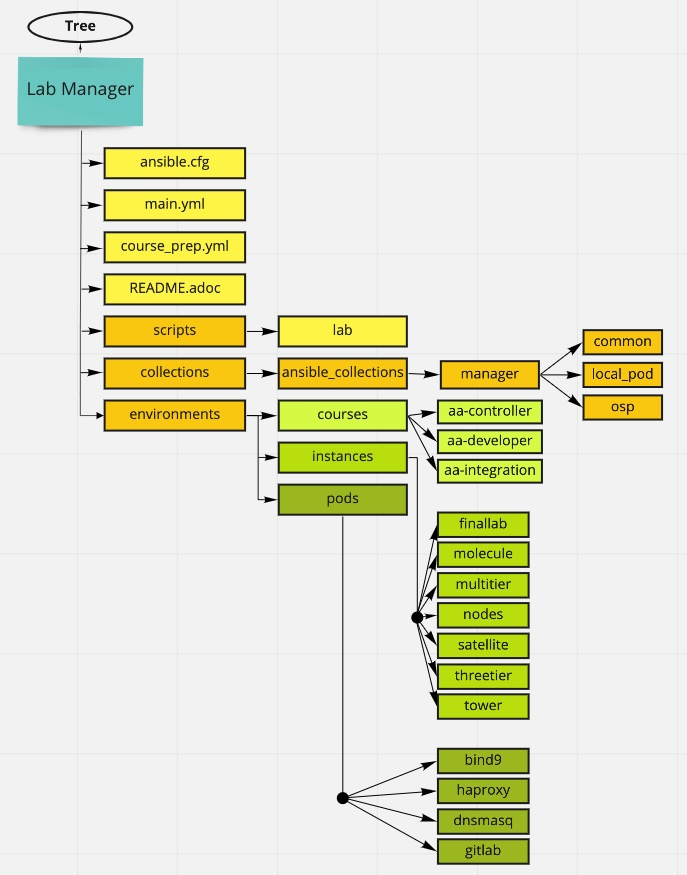
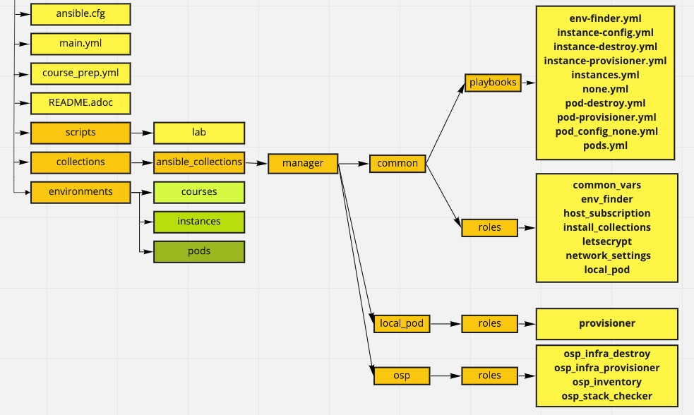
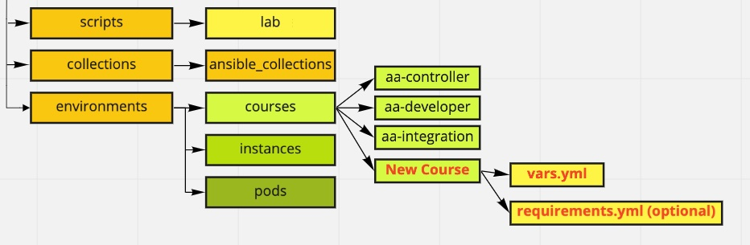
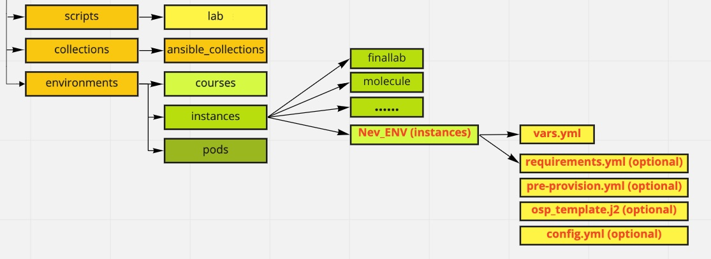
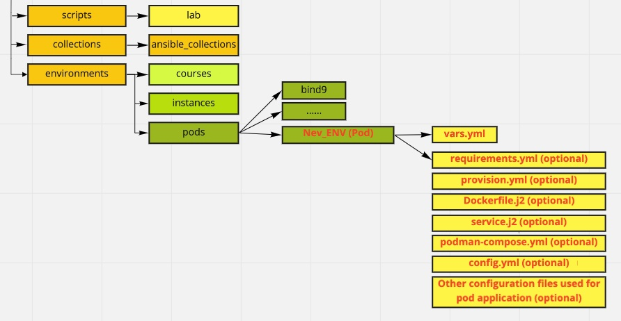

:scrollbar:
:data-uri:
:linkattrs:
:numbered:
:toc2:

= Lab-Manager
Mitesh Sharma <mitsharm@redhat.com>; Prakhar Srivastava <psrivast@redhat.com>

== Authors
.About {author_1}
[%collapsible]
====
Is *architect* in Product Field Enablement *(PFE)* team based out of Kanpur,India. He has been with Red Hat since 2018. He is expert for *Red Hat Automation Platform*. He helps in enabling partners and internals on Red Hat products.
====

.About {author_2}
[%collapsible]
====
Is *Senior Architect* in Product Field Enablement *(PFE)* team based out of Sydney, Australia. He has been with Red Hat since 2017. He is SME for *Red Hat Automation Platform and Red Hat Openshift*. He helps in enabling partners and internals on Red Hat products.
====

== Lab-Manager Architecture

.Architecture Tree

.Under The Hood Playbooks and Roles

.Placing New Course

.Creating New Infrastructure (Instances)

.Creating New Infrastructure (Pods)

.Environment Variables Dependency
[%autowidth,cols="a,a,a",options="header"]
|===
| Variable  | Default | Description
| GUID | Null | Unique ID of the environment
| SUBDOMAIN | Null | Subdomain name ie. dynamic.opentlc.com
| OPENTLC_USER_ID | Null | Owner/Candidate's user id
| OPENTLC_USER_EMAIL | Null | Owner/Candidate's email id 
| LAB_MGR_DIR | Null | Lab Manager's path where it will be cloned in bastion/control node
| CLOUD_PROVIDER | Null | Cloud provider ie. osp or ec2
| INTERNAL_DOMAIN | example.com | Internal domain name
|===

.End User Commands
[%autowidth,cols="a,a,a,a",options="header"]
|===
| Command  | Option | Arguments |Description
.10+^.^| *lab*  
  ^.^| prep    .2+^.^| <course name> | Will prepare classroom environment
  ^.^| cleanup | will destroy classroom environment
  .2+^.^| deploy 
                | -i <lab_name>/<env_name>/instance | will deploy instances
                | -p <lab_name>/<env_name>/pod       | willl deploy pods on bastion/control node
  .2+^.^| destroy
                | -i <lab_name>/<env_name>/instance | will destroy instances
                | -p <lab_name>/<env_name>/pod       | willl destroy pods on bastion/control node
  .2+^.^| reconfigure
                | -i <lab_name>/<env_name>/instance | will reconfigure instances
                | -p <lab_name>/<env_name>/pod       | willl reconfigure pods on bastion/control node
  ^.^| refresh   | -i satellite  | will refresh satellite manifest
  ^.^| -h | <null> | will show help
|===

== Demo Lab-Manager for AAP 2
=== Steps to prepare environment on Ansible Advanced - Lab CI (Test Env)

.Run following commands one by one on bastion
[%autowidth,cols="a,a,a",options="header"]
|===
| Sr No | Command | Description
| {counter:srn:1} |sudo su - devops | Switch to devops user
| {counter:srn}|cd /srv/lab-manager/ | Change directory
| {counter:srn}|sudo git checkout re-structure | re-structure branch has update lab-manager
| {counter:srn}|sudo cp scripts/lab  /usr/local/bin/ | replace old lab script
| {counter:srn}|cd $HOME | Go back to home
| {counter:srn}|lab refresh -i satellite | Refresh satellite manifest
| {counter:srn}|lab prep -c aa-developer | Deploy classroom environment pods
| {counter:srn}|lab reconfigure -i satellite | Adding aap2 early access repository in satellite. This is work around which will go away in future
| {counter:srn}|sudo subscription-manager repos --enable=ansible-automation-platform-2.0-early-access-for-rhel-8-x86_64-rpms | Enable AAP2.0 early access repository in bastion/control node.
| {counter:srn}|sudo subscription-manager repos --enable=ansible-automation-platform-2.1-for-rhel-8-x86_64-rpms | Enable AAP2.1 access repository in bastion/control node.

| {counter:srn}|sudo yum repolist all | List all repositories
| {counter:srn}|lab deploy -i aap2 | Provision nodes to run demo
|===

=== Steps to test AAP 2 on Ansible Advanced - Lab CI (Test Env)

. You can install ansible-core and and ansible-navigator on bastion as follows.
+
[source,text]
----
$ sudo yum install ansible-core ansible-navigator -y
----

. Test pinging all of the hosts using ansible-navigator.
+
[source,text]
----
$ cat > $HOME/ping.yml <<EOF
---
- hosts: all
  gather_facts: false
  tasks:
    - ping:
EOF
----

. You need to perform image registry authenication before you run ansible-navigator.
+
[source,text]
----
$ podman login -u your_email_id@redhat.com registry.redhat.io
password: <enter your password>
----

. Execute ansible-navigate as follows. 
+
[source,text]
----
$ ansible-navigator run  ping.yml -i /etc/ansible/hosts -u cloud-user -e ansible_ssh_private_key_file=.ssh/${GUID}key.pem
----

=== Test AAP 2 with Multitier deployment.

. Clone Multitier Application from following git repository on bastion.
+
[source,text]
----
$ cd $HOME
$ git clone https://github.com/tonykay/multi-tier-app-deployer.git
$ cd multi-tier-app-deployer
----

. Copy inventory file in repository directory as follows. 
+
[source,text]
----
$ cp /etc/ansible/hosts .
----

. Replace ansible.cfg file in cloned repository with following content as follows.
+
[source,text]
----
$ cat > ansible.cfg <<EOF
[defaults]
inventory               = hosts
remote_user             = cloud-user
private_key_file        = .ssh/${GUID}key.pem

EOF
----

. Now copy `$HOME/.ssh` directory in the git cloned repository as follows.
+
[source,text]
----
$ cp -r $HOME/.ssh .
----

. Install collection in current directory as follows.
+
[source,text]
----
$ ansible-galaxy collection install -r requirements.yml -p collections
----

. Perform image registry authenication before you can run ansible-navigator.
+
[source,text]
----
$ podman login -u your_email_id@redhat.com registry.redhat.io
password: <enter your password>
----

. You can now execute multtier deploy-app.yml playbook with ansible-navigator as follows.
+
[source,text]
----
$ ansible-navigator -m stdout run deploy-app.yml
----

. You can also test teardown-app.yml as follows.
+
[source,text]
----
$ ansible-navigator -m stdout run teardown-app.yml
----

.You can explore AAP 2 in following course
****
Course Name: Hands On Ansible Automation Platform 2

Course Link: https://www.opentlc.com/labs/hands_on_ansible_automation_platform_2/
****